# MechaCar_Statistical_Analysis
Statistics and R

## Project Overview

## Linear Regression to Predict MPG

### Multiple Linear Regression Model

The multiple linear regression model below takes in 5 different variables against the mpg, in order to identify which variables can be used for prediction and which ones cannot.

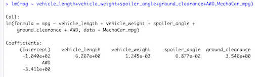

Which variables/coefficients provided a non-random amount of variance to the mpg values in the dataset?

- Based on the results, the variables vehicle_length and ground_clearance are the ones we could use to predict since they presented a non-random amount of variance to the mpg values, since they are above zero, while all the other ones are all 0 which means they are too random to use for prediction.

### Multiple Linear Regression Model Summary 

In order to identify if the slope of the linear model can be considered zero, the following multiple linear regression summary was generated:

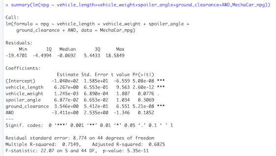

Is the slope of the linear model considered to be zero? Why or why not?
- It cannot be considered zero, because we have some that are not zero. Which are the vehicle length and the ground clearance because the p-value showed that they are smaller than 0.05.

Does this linear model predict mpg of MechaCar prototypes effectively? Why or why not?
- It depends on which value is been considered enough to be used for predictability. For this case the Adjusted R-squared is 0.6825, which means that 68% of the variance of the mpg comes form the 5 variables that we tested and 32% is caused by unknown factors. 
So, if a good model is considered to be 0.7 or 0.8, then the model we have does not predict the mpg of MechaCar prototypes effectively. On the other hand, if we say that the results are close enough and we accept that 33% is from unknown factors, then the results of our testes could be used.

## Summary Statistics on Suspension Coils

### Total Summary Dataframe

The Dataframe shown below represents the suspension coil’s PSI continuous variable across all manufacturing lots.

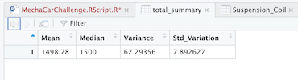

### Lot Summary Dataframe

The following lot summary shows the PSI metrics for each lot: mean, median, variance, and standard deviation.

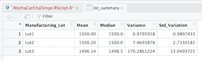

Does the current manufacturing data meet this design specification for all manufacturing lots in total and each lot individually? Why or why not?

- Having in consideration that the variance of the suspension coils must not exceed 100 pounds per square inch, the current manufacturing data meets this design specification when looking at the variance of the lots from a total  perspective. But it does not meet the specification when looking at them individually, where Lot3 exceeds the limit.

The reason why the data meets the specification for the lots as a total, is because Lot1 and Lot2 are very low, making the average of the three lots to fall into the accepted variance.

This shows that it is important to look at each lot individually to analyze, as looking at the total could have accepted a lot that does not meet the required specifications.

## T-Tests on Suspension Coils

### Analysing the PSI for all Lots

The following plot and t-test were created in order to determine if the PSI across all manufacturing lots is statistically different from the population mean of 1,500 pounds per square inch.

#### All Lots Plot

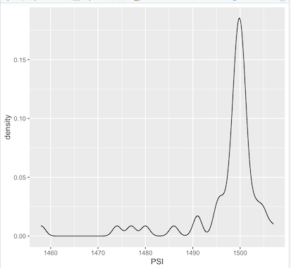

#### All Lots t-test

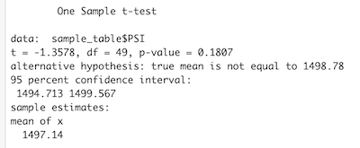

### Analysing the PSI by Lot Individually

using the t.test() function and its subset() argument to determine if the PSI for each manufacturing lot is statistically different from the population mean of 1,500 pounds per square inch.

#### Lot1

Plot:

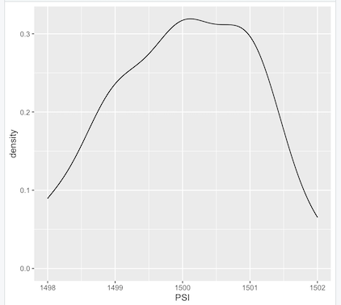

t-test:

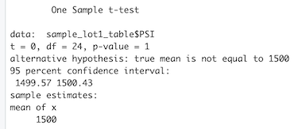

#### Lot2 

Plot:

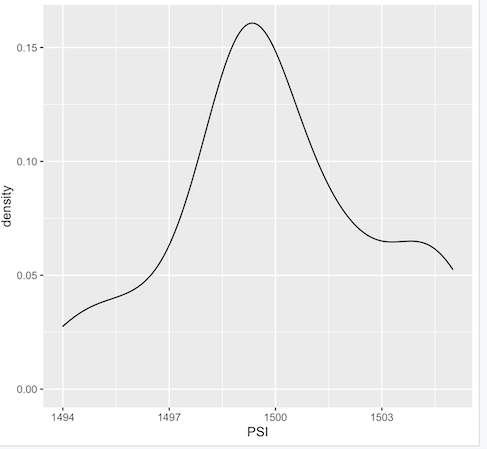

t-test:

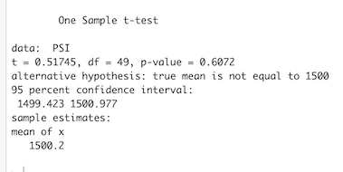

#### Lot3 

Plot:

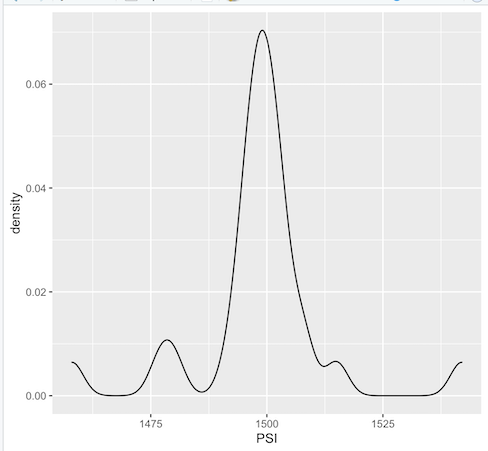

t-test:

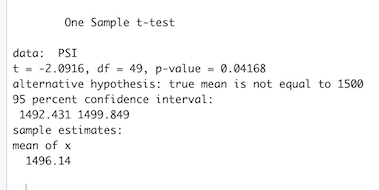

Analysisng the p-value of each lot individually shows that none of the three lots have a statictical difference.
