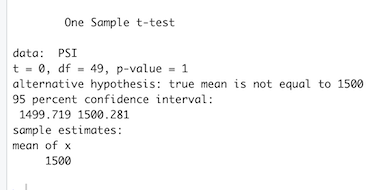

# MechaCar_Statistical_Analysis
Statistics and R

## Project Overview

The purpose of this project is to use the R programming language to to analyze a series of datasets from the automotive industry called MechaCar, where a series of statistical and hypothesis testings are performed.

## Linear Regression to Predict MPG

### Multiple Linear Regression Model

- The multiple linear regression model below takes in 5 different variables, vehicle length, vehicle weight, spoiler angle, ground clearance, and AWD, against the mpg, in order to identify which variables can be used for prediction and which ones cannot.

### Multiple Linear Regression Model Summary 

In order to identify if the slope of the linear model can be considered zero, the following multiple linear regression summary was generated:

- The slope of the linear model cannot be considered zero, because we have some that are not zero. Which are the vehicle length and the ground clearance because the p-value showed that they are smaller than 0.05.

- By examining the p-value in the last column, the only factors that are significant and account for the non-random variance are vehicle_lengthy and ground_clearance, where the p-value is being based on the traditional 0.05 for significance.
While the null hypothesis in linear regression assumes a value of 0 for the coefficient, the alternative hypothesis is not 0. So, the resulted p-values suggest they have none 0 coefficients.

Does this linear model predict mpg of MechaCar prototypes effectively? Why or why not?

- It depends on which value is been considered enough to be used for predictability. For this case the Adjusted R-squared is 0.6825, which means that 68% of the variance of the mpg comes from the 5 variables that we tested and 32% is caused by unknown factors. 
So, if a good model is considered to be 0.7 or 0.8, then the model we have does not predict the mpg of MechaCar prototypes effectively. On the other hand, if we say that the results are close enough and we accept the fact that 33% is from unknown factors, then the results of our testes could be used for predictability.

## Summary Statistics on Suspension Coils

### Total Summary Dataframe

The Dataframe shown below represents the suspension coil’s PSI continuous variable across all manufacturing lots.

### Lot Summary Dataframe

The following lot summary shows the PSI metrics for each lot: mean, median, variance, and standard deviation.

Does the current manufacturing data meet this design specification for all manufacturing lots in total and each lot individually? Why or why not?

- Having in consideration that the variance of the suspension coils must not exceed 100 pounds per square inch, the current manufacturing data meets this design specification when looking at the variance of the lots from a total  perspective. But it does not meet the specification when looking at them individually, where Lot3 exceeds the limit.

The reason why the data meets the specification for the lots as a total, is because Lot1 and Lot2 are very low, making the average of the three lots to fall into the accepted variance.

This shows that it is important to look at each lot individually to analyze, as looking at the total could have accepted a lot that does not meet the required specifications.

## T-Tests on Suspension Coils

### Analyzing the PSI for all Lots

The following plot and t-test were created in order to determine if the PSI across all manufacturing lots is statistically different from the population mean of 1,500 pounds per square inch.

#### All Lots t-test

The data for all manufacturing lots contained 150 points which were all tested with a t-test as shown below:

### Analyzing the PSI by Lot Individually

using the t.test() function and its subset() argument to determine if the PSI for each manufacturing lot is statistically different from the population mean of 1,500 pounds per square inch.

#### Lot1

The data for Lot1 was filter out from the original, so that it could be tested individually. Containing 50 data points, Lot1 was tested with a t-test as shown below:

Taking in consideration the decided significance level of 0.05 for the p-value, the result of 1 tells that the Suspension Coil PSI for Lot1 doesn't have a statistical difference from the population mean of 1,500, meaning that this lot is acceptable to be used/sold.

#### Lot2 

The data for Lot2 was filter out from the original, so that it could be tested individually. Containing 50 data points, Lot2 was tested with a t-test as shown below:

Taking in consideration the decided significance level of 0.05 for the p-value, the result of 0.6072 tells that the Suspension Coil PSI for Lot2 doesn't have a statistical difference from the population mean of 1,500, meaning that this lot is acceptable to be used/sold.

#### Lot3 

The data for Lot3 was filter out from the original, so that it could be tested individually. Containing 50 data points, Lot3 was tested with a t-test as shown below:

Taking in consideration the decided significance level of 0.05 for the p-value, the result of 0.04168 tells that the Suspension Coil PSI for lot 3 have a statistical difference from the population mean of 1,500, meaning that that this lot should be rejected.

## Study Design: MechaCar vs Competition

This study design is intended to describe a scenario and a test type to be be used when comparing a car from MechaCar and a competitor, addressing an aspect of the car that is possibly important for the consumer when buying one.

### Metrics

The chosen metrics to be tested are city and highway fuel efficiency.

### Null vs Alternative Hypothesis

The goal is to find out if the mpg performance of each car is equal or different, equal meaning null hypothesis and different meaning alternative hypothesis.

### Statistical Test

In order to find the overall performance of each SUV being tested, a 2 way t-test would be run using the mean of the city and highway mpg results.

Another useful finding would be to run a 2 way t-test on each SUV, using a subset or filter on the type of scenario, to compare the cars against both their city and highway performance.

### Dataset

To test the defined metrics, two very similar SUVs would be picked, one from MechaCar and one from a competitor such as Nissan and test their fuel efficiency for city and highway, by running a sequence of tests on each one of them, where employees would drive each car on each of the presented scenarios multiple times and record the results for comparison.

